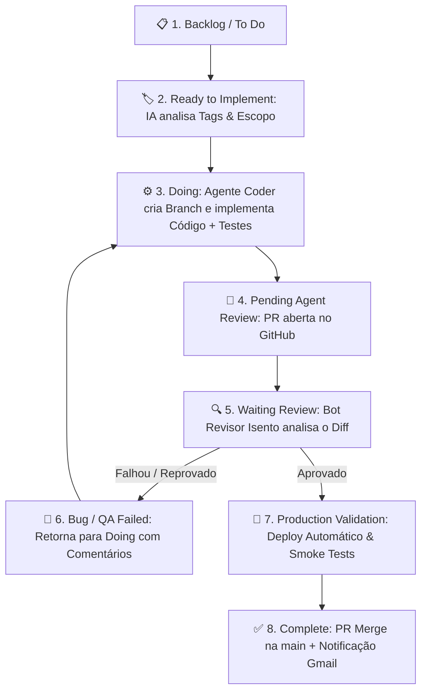

# 🚀 Plano de Evolução do Kanban: Esteira Autônoma de Desenvolvimento (Linear Flow)

Este documento orienta a implementação das novas colunas e automações no **Kanban POC Automation**, alinhando-o com a esteira autônoma de desenvolvimento de software impulsionada por IA (inspirada no fluxo do Linear).

---

## 📊 1. Novas Colunas a Serem Adicionadas no Kanban Local

Para suportar o ciclo de desenvolvimento multi-agente, o Kanban deve evoluir das 10 colunas atuais para **13 colunas**:

| # | Nome da Coluna | Descrição & Função no Fluxo de IA |
|---|---|---|
| 1 | `Backlog` | Cadastro de ideias e demandas brutas. |
| 2 | `To Do` | Tarefas priorizadas pelo P.O. prontas para refinement. |
| 3 | 🆕 **`Ready to Implement`** | **Classificação Autônoma**: A IA analisa as tags (`frontend`, `backend`, `lambda`, `database`), seleciona o agente especializado e prepara o ambiente. |
| 4 | `Doing` | **Desenvolvimento Ativo**: O Agente Coder cria a branch (`feature/USE-xxx`), escreve o código e testes unitários. |
| 5 | 🆕 **`Pending Agent Review`** | **Fila de Code Review**: Código commitado e Pull Request aberta no GitHub, aguardando o Bot Revisor autônomo. |
| 6 | `Waiting Review` (In Code Review) | **Revisão Isenta de IA**: Um 2º Bot de IA (descontaminado, em sessão isolada) realiza a revisão estática do código, buscando vulnerabilidades e violações do Design System. |
| 7 | `Waiting Response` (Pending Review) | **Revisão Humana**: Aguardando aprovação ou feedback do desenvolvedor/owner (*Human-in-the-loop*). |
| 8 | `Blocked` | Tarefa travada por falta de credenciais, API externa indisponível ou decisão pendente. |
| 9 | `Bug` (QA Failed) | Reprovação nos testes de integração ou segurança (o card é retornado automaticamente para `Doing`). |
| 10 | 🆕 **`Production Validation`** | **Deploy & Smoke Tests**: Deploy automático realizado em ambiente de validação e execução de testes de fumaça pós-deploy. |
| 11 | `Complete` (Done) | PR mesclada na `main`, card finalizado e relatório enviado aos interessados via e-mail. |
| 12 | `Closed` (Canceled) | Tarefas canceladas ou descontinuadas. |
| 13 | 🆕 **`Duplicate`** | Tarefas duplicadas identificadas automaticamente pela IA. |

---

## 🔄 2. O Fluxo de Execução Multi-Agente (Step-by-Step)



---

## 💻 3. Mudanças Necessárias no Código do Kanban POC

### A. Backend (`Kanban-com-TanStack-Start-e-Query-Form-back-end`)

1. **Atualizar os Zod Schemas (`create-task.dto.ts` e `update-task.dto.ts`)**:
```typescript
export const CreateTaskSchema = z.object({
  title: z.string().min(1, 'Title is required'),
  status: z.enum([
    'Backlog',
    'To Do',
    'Ready to Implement',      // 🆕 Nova coluna
    'Doing',
    'Pending Agent Review',   // 🆕 Nova coluna
    'Waiting Response',
    'Waiting Review',
    'Waiting Test',
    'Production Validation',  // 🆕 Nova coluna
    'Blocked',
    'Bug',
    'Complete',
    'Closed',
    'Duplicate',              // 🆕 Nova coluna
  ]),
  // ... demais campos
});
```

2. **Atualizar o Seed do Banco (`src/seed/seed.service.ts`)**:
   - Atualizar a lista de colunas default e tasks de exemplo para utilizar os novos status.

---

### B. Frontend (`Kanban-com-TanStack-Start-e-Query-Form`)

1. **Atualizar o Enum/Tipo de Colunas (`src/types/kanban.ts`)**:
   - Incluir as novas colunas no array de colunas renderizadas no board Kanban (`COLUMN_CONFIGS`).

2. **Estilização dos Badges de Status**:
   - Atribuir cores visuais no Dark Mode Notion para cada nova coluna:
     - `Ready to Implement`: Azul Celeste (`#3b82f6`)
     - `Pending Agent Review`: Roxo (`#8b5cf6`)
     - `Production Validation`: Laranja Ambar (`#f59e0b`)
